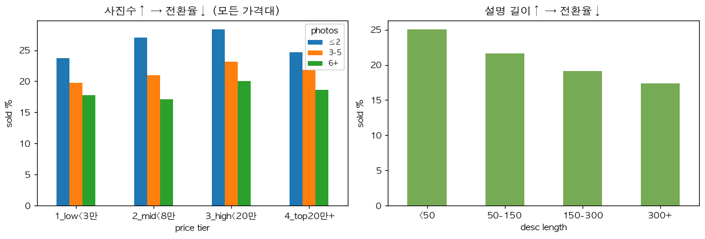
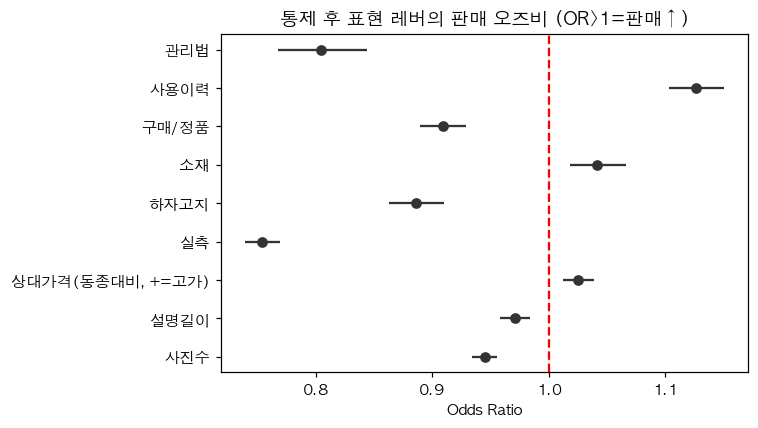
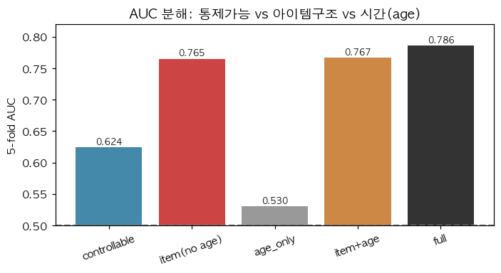
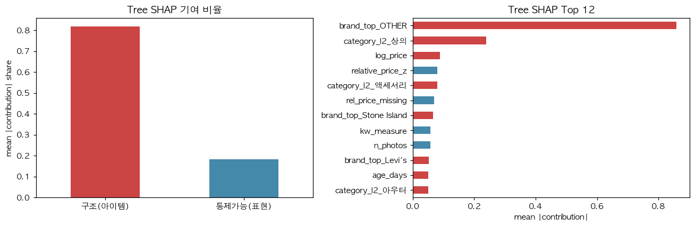
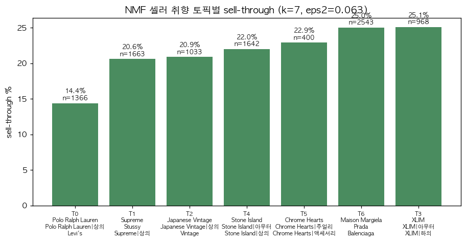
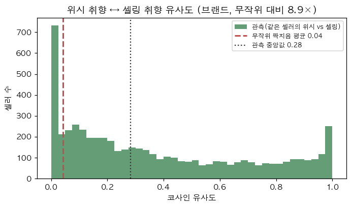
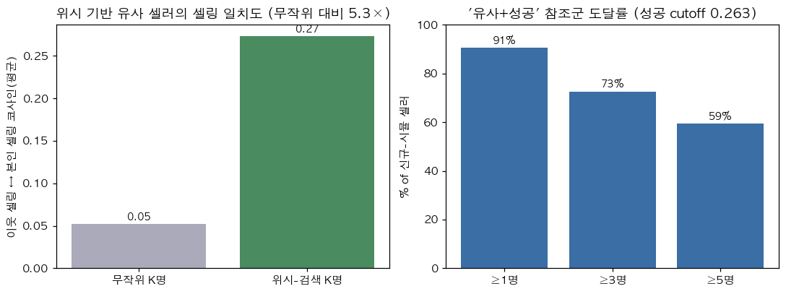
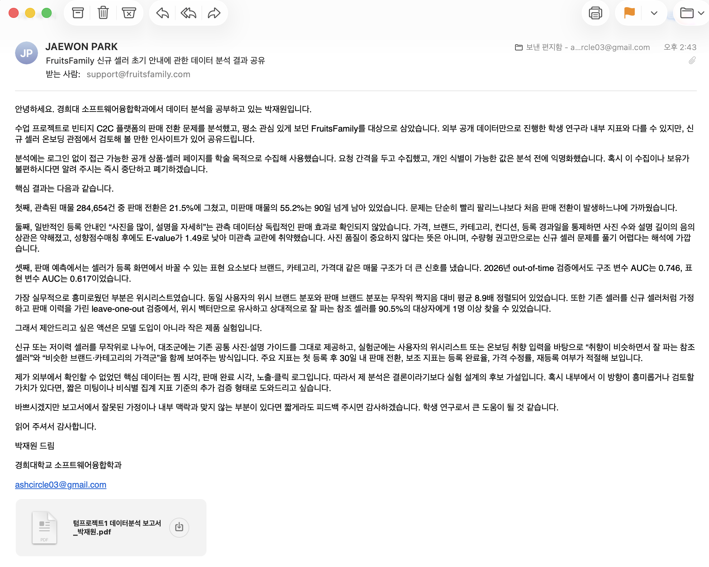

빈티지 C2C 패션 플랫폼의 판매 결정요인과 위시리스트 기반 신규 셀러 초기 안내

소프트웨어융합학과 3학년 박재원
학번: 2022105461

초록 (Abstract)

빈티지 의류 C2C는 동일 상품이 없는 1점물을 다뤄 표준화 마켓의 시세 비교와 매칭 공식을 쓰기 어렵고, 낮은 판매 전환은 신규 셀러에게 큰 진입 장벽이 된다. 본 연구는 FruitsFamily 매물 284,654건과 셀러 약 1만 1천 명을 바탕으로 판매 전환이 일반 등록 권고, 매물 구조, 공개 위시리스트 중 무엇과 연관되는지를 검토했다. 분석은 로지스틱 회귀와 성향점수매칭, XGBoost 변수군 비교와 out-of-time 검증, NMF 취향 토픽과 위시 및 셀링 취향 유사도로 구성했다. 관측 자료만으로는 사진과 설명 권고의 독립적 효과를 입증하기 어려웠고, 예측에서는 구조 변수가 표현 변수보다 큰 신호를 냈다. 2026년 out-of-time 검증 AUC는 구조 변수 0.746, 표현 변수 0.617이었다. 동일 사용자 내 위시 취향과 셀링 취향은 브랜드 수준에서 무작위 대비 8.9배 정렬되어 신규 셀러 초기 안내의 후보 신호가 될 수 있었다. 본 연구의 기여는 빈티지 판매를 완성된 예측 문제가 아니라 통제 실험으로 검증할 초기 안내 가설로 재정의한 데 있다.

1. 서론

중고와 리세일 패션 시장은 성장하고 있으나[1], 당근마켓, 번개장터, KREAM 등은 표준화 재화를 전제로 한 위치 기반 신뢰와 시세 비교에 강점을 둔다[2]. 반면 FruitsFamily 같은 빈티지 플랫폼은 동일 품목이 없는 1점물을 다루며[3], 팔로우와 공개 위시리스트라는 수요 측 취향 그래프를 가진다.

본 자료에서 매물의 78.5%는 판매되지 않았고, 미판매 매물의 55%는 90일 넘게 남아 있었으며, 셀러 15.9%는 한 건도 판매하지 못했다. 따라서 문제는 판매 속도 개선보다 판매 전환 자체의 발생 여부에 가깝고, 그 부담은 판매 이력이 없는 신규 셀러에게 크다. 그러나 실제 등록 과정은 사진, 제목, 설명, 브랜드, 카테고리, 상태 입력과 공통 사진 가이드를 모든 셀러에게 동일하게 제공한다. 원시 자료에서는 사진 2장 이하 매물의 전환율이 26.4%로 6장 이상 18.7%보다 높고, 설명 50자 미만 25.0%도 300자 이상 17.3%보다 높아 권고를 따른 매물이 오히려 덜 팔리는 역설이 보인다([그림 1]).

*[그림 1] 일반 가이드의 역설. 사진이 많을수록, 설명이 길수록 원시 전환율은 낮다.*

기존 중고 패션 연구는 구매자 동기, 신뢰, 가격에 치우쳐 셀러 행동이 비표준 빈티지 판매와 어떻게 연관되는지 충분히 다루지 않았다. 본 연구는 판매 전환(`is_sold`)을 결과변수로 세 가설을 검정한다.

가설 1. 사진과 설명의 음의 상관은 어려운 매물에 노력이 몰리는 역선택 교란에 상당 부분 기인하며, 매물 속성을 통제하면 권고의 독립적 기여는 관측 자료만으로 입증하기 어렵다.

가설 2. 판매는 셀러가 통제하는 표현 요소보다 통제하기 어려운 구조 요소인 브랜드, 가격, 카테고리와 더 강하게 연관되며, 이 우위는 out-of-time 검증에서도 유지된다.

가설 3. 판매 목록과 공개 위시리스트는 브랜드 및 하위 카테고리 취향 공간에서 정렬되며, 이 신호는 신규 셀러 초기 참조군 산출의 후보가 된다.

이를 위해 공개 매물·셀러 데이터를 수집해 세 단계로 분석했다. 가설 1은 로지스틱 회귀, 성향점수매칭, E-value로 일반 권고의 독립 효과를 검토했고, 가설 2는 XGBoost 변수군 비교와 2026년 out-of-time 검증으로 표현 변수와 구조 변수의 예측 신호를 비교했다. 가설 3은 NMF 취향 토픽과 위시·셀링 코사인 유사도로 신규 셀러 참조군 가능성을 확인했다. 분석 결과는 공통 등록 가이드보다 매물 구조와 수요 측 취향 그래프가 신규 셀러 초기 안내에 더 직접적인 단서가 될 수 있음을 보였다.

2. 관련 연구

2.1. 중고 패션 연구. 구매자 동기와 신뢰 중심

중고 패션 연구는 지속가능성, 가격 민감도, 희소성, 신뢰 같은 구매자 동기를 주로 다룬다[1][3]. C2C 거래 연구도 평판과 가격 전략, 판매자와 소비자의 동태적 의사결정에 관심을 둔다[4][5]. 이 흐름은 중고 소비가 왜 일어나는지 설명하는 데 유용하지만, 신규 셀러가 어떤 등록 정보를 보고 첫 판매 가능성을 높일 수 있는지에는 직접 답하지 않는다. 본 연구는 구매 의도나 가격이 아니라 매물 단위 판매 전환(`is_sold`)을 결과변수로 두어 플랫폼 유동성 문제를 셀러 관점에서 다룬다.

2.2. 등록 가이드와 이미지 연구. 표현 노력의 효과가 불명확함

산업 가이드와 서비스 온보딩은 사진을 많이 올리고 설명을 자세히 쓰라는 공통 권고를 제공한다[6]. 이미지 품질이 신뢰와 거래 성과에 연관된다는 연구도 있으나, 조회 수처럼 등록 이후 누적되는 사후 변수가 강한 예측자로 함께 나타나 셀러가 등록 시점에 통제할 수 있는 요소의 독립 기여는 분명하지 않다[7]. 당근마켓, 번개장터, KREAM 등 표준화 재화에 강한 서비스는 위치, 신뢰, 시세 비교를 중심으로 문제를 푼다[2]. 반면 FruitsFamily의 빈티지 매물은 동일 상품이 거의 없어 단순 시세 비교와 공통 등록 가이드만으로는 신규 셀러의 의사결정을 충분히 돕기 어렵다.

2.3. 추천과 콜드스타트. 사이드 정보는 있으나 셀러 진입 문제는 다르다

추천 시스템의 콜드스타트 연구는 구매·평점 이력이 부족할 때 속성, 콘텐츠, 관계 같은 사이드 정보로 초기 선호를 추정한다[8]. 패션 표현 학습도 스타일 임베딩을 만들 수 있지만, 그것이 곧바로 빈티지 셀러의 판매 전환이나 초기 가격·참조군 안내로 이어지지는 않는다[9]. FruitsFamily에는 일반 추천 시스템과 다른 공개 위시리스트가 있다. 이는 구매자 추천뿐 아니라, 신규 셀러가 어떤 취향권에서 자신의 매물을 해석해야 하는지 알려 주는 수요 측 신호가 될 수 있다.

2.4. 본 연구의 차별점. 문제 해결을 위한 분석 설계

본 연구는 기존 연구와 서비스 관행을 세 가지 방식으로 확장한다. 첫째, 일반 등록 권고의 효과를 단순 상관이 아니라 가격, 브랜드, 카테고리, 컨디션, 등록 경과일을 통제한 로지스틱 회귀와 성향점수매칭, E-value로 검토한다. 둘째, 사진·설명 같은 표현 변수와 브랜드·가격·카테고리 같은 구조 변수를 분리해 XGBoost 변수군 비교와 2026년 out-of-time 검증으로 어느 쪽이 더 큰 예측 신호인지 확인한다. 셋째, 공개 위시리스트와 판매 목록의 취향 정렬을 NMF 토픽과 코사인 유사도로 검증하고, 이를 신규 셀러에게 유사 참조군과 비교 가격군을 제시하는 제품 실험 가설로 연결한다. 따라서 본 연구의 목적은 완성된 예측 모델 제시가 아니라, FruitsFamily가 실제로 검증할 수 있는 신규 셀러 초기 안내 실험의 근거를 만드는 것이다.

3. 본론

자료는 FruitsFamily를 학술 목적 식별자로 크롤링해 구축했다. 수집 288,903건에서 임시 행과 핵심 항목 결측을 제외한 284,654건, 셀러 약 1만 1천 명, 2020년부터 2026년까지의 매물을 분석했고 전체 전환율은 21.5%다. 수집은 최신 등록순과 특정 시드 브랜드에서 출발했으므로 플랫폼 전체 대표 표본은 아니지만, 표본이 충분한 2022년 이후 등록 코호트의 미판매율이 77.5~80.4%에 머물고 1년 이상 노출된 성숙 매물에서도 미판매율이 78.6%라 낮은 전환은 최근 등록 표집만의 산물로 보기 어렵다.

설명 변수는 사진 수, 설명 길이, 키워드, 상대 가격 같은 표현 요소와 브랜드, 카테고리, 컨디션, 가격, 등록 경과일 같은 구조 요소로 나눴다. 상대 가격은 우선 브랜드×대분류 카테고리×컨디션 내 로그가격 z-score로 계산하고, 표본이 부족하면 브랜드×대분류 카테고리를 대체 기준으로 사용한 가격 포지셔닝 근사다. 그래도 산출되지 않는 9,332건은 전환율이 53.7%로 비결측군 20.4%보다 높아 희소 및 특수 매물 신호일 수 있으므로 결측 인디케이터로 보존했다. 이 처리는 결측을 평균적인 가격 위치로 간주하기 위한 것이 아니라, 동종 그룹이 형성되지 않는 매물 자체가 별도 신호일 수 있다는 도메인 판단을 반영한 것이다. 조회 수와 찜 수는 등록 후 누적되는 누수 변수라 제외했다. 등록 화면에서 셀러가 처음 결정할 수 있는 정보만 남겨야 신규 셀러 안내라는 문제 설정과 예측 시점이 맞기 때문이다.

3.1. 일반 권고의 독립적 기여는 관측상 입증하기 어렵다

판매 전환을 종속변수로 한 로지스틱 회귀에서 가격, 브랜드, 카테고리, 컨디션, 등록 경과일을 통제했다. 사진 수 OR은 통제 전 0.874에서 통제 후 0.945로, 설명 길이 OR은 0.924에서 0.971로 음의 효과가 약화됐다. 사진 3장 이상 권고도 2장 이하 대비 3장에서 5장은 0.915, 6장 이상은 0.855로 감소했다([그림 2]). 사진 수, 설명 길이, 상대 가격으로 본 수량형 등록 레버 중 양의 방향은 상대 가격뿐이었고 OR은 1.025로 작았다. 키워드 항목은 소재와 사용이력은 양의 방향, 실측과 하자고지 등은 음의 방향으로 갈려 자세한 설명을 하나의 처방으로 묶기 어렵다.

*[그림 2] 통제 후 표현 요소별 판매 오즈비와 95% 신뢰구간. 사진 수와 설명 길이는 1보다 낮고, 키워드 신호는 항목별로 방향이 갈린다.*

권고 준수를 처치로 둔 성향점수매칭에서는 사진 3장 이상과 설명 150자 이상을 처치로 정의했다. 가격, 브랜드, 카테고리, 컨디션, 등록 경과일로 성향점수를 추정하고 caliper 0.02의 최근접 매칭 후 ATT를 계산했다. ATT는 -2.2%p였으나 E-value는 1.49에 그쳤다. 매물의 심미성, 핏, 희소성 같은 미관측 교란이 조금만 강해도 결론이 뒤집힐 수 있다는 뜻이다. 본 연구의 표현 변수는 사진 수와 설명 길이 같은 양적 지표이며, 사진의 밝기, 해상도, 배경 정돈도, 착용 핏을 포함하지 못했다. 따라서 이 결과는 사진 품질이 중요하지 않다는 뜻이 아니라, 수량형 권고 지표만으로 독립적 처방 효과를 입증하기 어렵다는 뜻이다. 팔기 어려운 매물일수록 설명과 사진을 보강했다면 사진 수 계수는 아래로 편향된다. 노출 기간이 비슷한 성숙 매물에서 사진 OR은 0.984로 1에 수렴하지만, 판매 완료 시점이 없어 30일 내 판매 여부나 Cox 비례위험모형을 검증하지는 못했다.

이 결과는 기존 등록 가이드의 필요성을 부정하지 않는다. 사진과 설명은 거래 신뢰를 위한 최소 품질 조건으로 유지하되, 모든 셀러에게 같은 수량형 권고를 주된 전환 처방으로 제시하는 방식은 판매 전환 문제를 직접 해결하지 못할 수 있다. 신규 셀러에게 더 필요한 정보는 사진을 몇 장 더 찍으라는 지시보다, 자신의 매물이 어떤 취향권과 비교군 안에서 평가될 수 있는지 알려 주는 기준점이다.

3.2. 구조적 요인이 표현적 노력보다 큰 예측 신호를 낸다

판매 전환을 예측하는 XGBoost에서 표현 변수만 넣은 모형, 구조 변수만 넣은 모형, 전체 모형의 AUC를 비교했다. 무작위 5겹 AUC는 표현 0.625, 구조 0.768, 전체 0.788이었고 PR-AUC는 0.330, 0.447, 0.481이었다. 양성률이 21.5%인 불균형 자료에서 무작위 순위기의 기대 PR-AUC는 양성률과 같으므로, 2026년 구조 모형 PR-AUC 0.394는 기준선을 넘지만 운영 예측기로 보기에는 부족하다. 즉 이 모델은 팔릴 매물을 자동 선별하는 도구라기보다, 어떤 변수군이 판매 전환을 더 잘 설명하는지 비교하는 분석 장치에 가깝다. 등록연도 기준 out-of-time 검증에서도 표현 0.617, 구조 0.746, 전체 0.772로 구조 우위가 유지됐다([표 1]).

[표 1] 변수 집단별 판매 전환 예측 성능

| 변수 집단 | 5겹 AUC | 5겹 PR-AUC | 2026 out-of-time AUC | 2026 out-of-time PR-AUC |
|---|---:|---:|---:|---:|
| 통제 가능한 표현 | 0.625 | 0.330 | 0.617 | 0.316 |
| 매물 구조 | 0.768 | 0.447 | 0.746 | 0.394 |
| 전체 | 0.788 | 0.481 | 0.772 | 0.441 |

순열검정에서 전체 모형은 우연 수준 0.5를 유의하게 넘었고, 구조와 표현의 AUC 차이는 95% 구간 [0.138, 0.151]로 0을 제외했다. 등록 경과 시간만의 AUC는 0.530에 그쳐 구조 우위가 절단 효과만은 아님을 보인다([그림 3]). Tree SHAP과 순열 중요도도 구조 변수군의 예측 기여가 크다는 방향을 보였고, 단일 변수로는 비주류 브랜드 여부가 가장 강했다([그림 4]). 브랜드, 가격, 카테고리는 서로 얽혀 있으므로 SHAP은 개별 변수의 인과적 중요도가 아니라 변수군 수준의 보조 해석으로 사용한다. 표현의 한계 기여는 전체 모형과 구조 모형의 AUC 차이 0.021로 작았다. 따라서 신규 셀러에게 필요한 것은 노력 독려보다 브랜드, 카테고리, 가격대의 진입 기준점일 수 있다. 다만 현재 상대 가격은 브랜드, 대분류 카테고리, 컨디션만으로 동종 비교군을 정의하므로 1점물의 연식, 핏, 사이즈, 디자인 맥락을 충분히 반영하지 못한다. 가격 관련 인사이트를 더 강하게 만들려면 제목 토큰, 세부 카테고리, 사이즈, 희소 브랜드 여부를 포함한 유사매물 기준가격을 만들고, 그 기준가격 대비 잔차나 백분위를 다시 검증해야 한다.

비주류 브랜드 여부가 강한 신호로 나타난 점도 단순히 유명 브랜드가 잘 팔린다는 의미로 읽기 어렵다. 빈티지 시장에서는 대중적 브랜드, 하이엔드 브랜드, 소규모 디자이너 브랜드가 서로 다른 수요층을 가지며, 같은 가격이라도 어느 취향권에 놓이는지에 따라 전환 가능성이 달라진다. 따라서 구조 변수의 우위는 가격과 브랜드를 고정된 서열로 보라는 뜻이 아니라, 매물의 시장 위치를 먼저 파악해야 표현 노력의 효과도 해석할 수 있다는 뜻이다.

*[그림 3] 변수 집단별 예측 AUC. 시간만으로는 0.53에 그쳐 구조의 우위는 시간의 산물만은 아니다.*

*[그림 4] Tree SHAP 기반 변수 기여 요약. 개별 변수의 인과효과가 아니라 구조 변수군의 예측 신호를 보는 보조 해석이다.*

3.3. 셀러 취향의 비지도 구조와 신규 셀러 초기 안내

셀러 스타일은 정답 라벨이 없으므로 브랜드와 하위 카테고리 조합을 이용해 NMF 취향 토픽을 추정했다. 매물 5건 이상 셀러 9,615명을 대상으로 `brand`와 `brand×category_l2` 토큰을 TF-IDF 벡터화하고, 각 셀러를 가장 큰 가중치의 토픽으로 요약했다. PCA는 음수 적재값이 생겨 브랜드 묶음의 의미를 설명하기 어렵고, K-means는 한 셀러를 하나의 군집에 강제로 배정해 혼합 취향을 잃기 쉽다. NMF는 비음수 가중치의 덧셈 구조라 여러 브랜드 취향이 섞인 셀러를 토픽 가중치로 표현할 수 있고, 각 토픽의 상위 브랜드를 보고 해석하기 쉽다. 토픽 수는 판매 전환율을 보지 않고 정했다. 지나치게 작은 토픽과 한 토픽 쏠림을 피하기 위해 최소 토픽 크기 300명 이상, 최대 토픽 점유율 35% 이하, 주도 토픽 가중치 중앙값 0.55 이상을 만족하는 가장 작은 k를 택해 7개 토픽을 사용했다. 주도 토픽 가중치 중앙값은 0.586으로, 셀러 다수가 하나의 순수 유형보다 혼합 취향에 가깝다.

토픽 간 전환율은 사후적으로 검토했다. Polo Ralph Lauren, Levi's, Adidas 계열은 14.4%, Maison Margiela, Prada, Balenciaga, Rick Owens 계열은 25.0%, XLIM, Hatchingroom, Post Archive Faction 계열은 25.1%였다. 크러스컬 월리스 검정은 p<0.001, 효과크기는 ε²=0.063이었고, 저유동성 토픽은 기준 토픽 대비 통제 후에도 OR 0.47로 낮았다([그림 5]). H3의 핵심은 셀러를 고정된 집단으로 분류하는 것이 아니라, 취향 토픽이 신규 셀러 참조군을 찾는 해석 가능한 중간 표현이 될 수 있음을 보이는 데 있다.

*[그림 5] NMF 기반 셀러 취향 토픽별 전환율. 토픽은 단일 군집 라벨이 아니라 주도 토픽 요약이다.*

신규 셀러에게 어떤 초기 참조 정보를 줄 수 있는지도 확인했다. 같은 셀러라도 파는 브랜드는 다양하지만 공급 집중도 중앙값은 0.107이고, 위시 집중도 중앙값은 0.222였다. 위시 브랜드 분포와 셀링 브랜드 분포의 코사인 유사도 평균은 0.373, 중앙값은 0.283이었다. 평균 기준으로 owner와 seller를 무작위로 섞은 null 0.042의 8.9배였다([그림 6]). NMF 토픽 공간에서도 위시와 셀링 코사인 평균은 0.693, 중앙값은 0.793이었고 평균 기준으로 null 0.378의 1.8배였다. 이는 안내에 쓰기 쉬운 저차원 취향 표현이다.

*[그림 6] 같은 셀러의 위시와 셀링 브랜드 코사인 유사도. 관측 평균이 무작위 짝지음 평균의 8.9배다.*

leave-one-out 검증에서는 위시와 셀링을 모두 가진 셀러 5,492명의 셀링을 가리고 브랜드 단위 위시 벡터로 기존 셀러 9,589명을 검색했다. 참조군 검색은 정보 손실을 줄이기 위해 브랜드 원공간 벡터를 사용했고, NMF 토픽은 결과를 해석 가능한 저차원 취향 표현으로 요약하는 데 사용했다. 상위 30명의 실제 셀링 취향은 본인 셀링과 평균 코사인 0.273으로 무작위 0.052의 5.3배 가까웠고, 전환율 상위 1/3 셀러는 프록시 신규 셀러의 90.5%에 1명 이상 잡혔다([그림 7]). 이들은 취향이 비슷하면서 상대적으로 잘 파는 참조군 후보가 된다. 다만 위시리스트에는 찜 시각이 없어 위시가 판매보다 먼저 형성된 취향인지, 판매 이후 시장조사 과정에서 형성된 행동인지 구분할 수 없다. 따라서 8.9배 정렬은 인과가 아니라 횡단면 정렬이며, 실제 신규 셀러 효과는 내부 로그 기반 실험으로 확인해야 한다.

참조군은 단일 모범 셀러를 지정하는 방식이 아니라 비교 기준을 제공하는 방식으로 해석해야 한다. 신규 셀러에게 특정 셀러의 방식을 그대로 따르도록 제시하면 희소 매물의 맥락을 과도하게 단순화할 수 있다. 더 적절한 화면은 유사 취향권에서 잘 팔린 셀러들의 대표 브랜드, 가격 범위, 등록 완료율이 높은 입력 항목을 함께 보여 주고, 사용자가 자신의 매물 위치를 판단하게 돕는 형태다.

동종 비교 가격군은 조건 결측을 별도 범주로 두면 매물의 92.3%에 산출 가능했고, 가격백분위 분석에 쓴 원 조건 기준 유효 표본도 90.8%였다. 현재의 브랜드, 카테고리, 컨디션 기준 가격 위치는 전환을 거의 가르지 못했다. 하위 25% 전환율은 19.2%, 상위 25%는 19.9%였다. 이 결과는 가격이 중요하지 않다는 뜻보다, 현재의 동종 정의가 빈티지 1점물의 실제 비교군을 충분히 만들지 못했다는 증거에 가깝다. 같은 브랜드와 카테고리라도 사이즈, 연식, 실루엣, 소재, 그래픽, 아카이브 희소성에 따라 수요가 달라지기 때문이다. 따라서 가격군은 판매 확률 처방이 아니라 시세가 없는 1점물에서 신규 셀러의 불확실성을 줄이는 참고 정보로 해석해야 한다. 향후에는 제목, 하위 카테고리, 사이즈, 희소 브랜드 여부까지 반영한 유사매물 기준가격으로 재검증해야 한다.

*[그림 7] 위시 기반 참조군 검색 결과. 프록시 신규 셀러의 90.5%에 유사하고 상대적으로 잘 파는 참조 셀러를 1명 이상 산출했다.*

4. 결론

세 가설을 종합하면, 관측 자료로는 일반 등록 권고가 전환을 끌어올린다는 증거를 찾기 어려웠고, 예측에서는 매물 구조가 표현보다 큰 신호를 냈으며 이 우위는 2026년 out-of-time 검증에서도 유지됐다. 다만 PR-AUC 수준상 완성된 운영 예측기가 아니라 변수군 간 상대 신호 비교로 해석해야 한다. NMF 취향 토픽은 전환율 차이를 더 해석 가능하게 만들지만, 주도 토픽 가중치 중앙값 0.586은 셀러 다수가 혼합 취향에 가깝다는 점을 보인다. 표준화 마켓의 공식인 노력 독려, 동일 상품 시세, 스타일 강화만으로는 비표준 빈티지의 낮은 판매 전환을 설명하기 어렵다.

본 연구가 제시하는 방향은 수요 측 취향 그래프다. 위시와 셀링 취향이 횡단면에서 8.9배 정렬되므로 위시리스트는 신규 셀러에게 유사 참조군을 제시하는 초기 안내 신호가 될 수 있고, 프록시 도달률은 90.5%였다.

따라서 다음 단계는 모델 고도화가 아니라 제품 실험이다. 신규 또는 저이력 셀러를 무작위로 나누어, 대조군에는 기존 공통 사진·설명 가이드를 제공하고 실험군에는 위시 취향 또는 온보딩 취향 입력을 바탕으로 유사하면서 전환율이 높은 참조 셀러와 비교 가격군을 보여준다. 실험군 화면은 브랜드와 카테고리 입력 직후 취향이 비슷한 참조 셀러, 해당 취향권의 대표 가격 범위, 비슷한 매물의 장기 미판매 위험 신호를 제공하는 방식이 적절하다. 주요 지표는 첫 등록 후 30일 내 판매 전환, 보조 지표는 등록 완료율, 가격 수정률, 재등록 여부로 둔다. 이 실험에는 내부의 찜 시각, 판매 완료 시각, 노출·클릭 로그가 필요하며, 본 연구의 관측 결과는 그 실험을 설계하기 위한 후보 가설로 쓰여야 한다.

분석이 보고서 안에 머무르지 않도록, 위 결과와 실험 제안을 FruitsFamily 측에 메일로 공유했다. 이는 본 연구의 인사이트를 실제 서비스 운영자가 검토할 수 있는 액션으로 연결한 시도이며, 내부 로그가 제공될 경우 가설 검증과 실험 설계를 더 구체화할 수 있다.

*[그림 8] 분석 결과의 실무 제안 전달. 본 연구에서 도출한 신규 셀러 초기 안내 실험안을 FruitsFamily 측에 메일로 공유해, 관측 데이터 기반 인사이트를 실제 서비스 검토 가능한 액션으로 연결했다.*

5. 참고 문헌

[1] F. G. Gilal, A. R. Shaikh, Z. Yang, R. G. Gilal, and N. G. Gilal, "Secondhand consumption: A systematic literature review and future research agenda," International Journal of Consumer Studies, vol. 48, no. 3, e13059, 2024, doi: 10.1111/ijcs.13059.
[2] 져니박, "'플랫폼 속 4989' ①중고거래 편: 당근마켓, 번개장터, 크림," 요즘IT, 2021.
[3] H. H. Park, "Scarce fashion products consumption in the C2C second-hand trading platform," Family and Consumer Sciences Research Journal, vol. 51, no. 3, pp. 216-230, 2023, doi: 10.1111/fcsr.12471.
[4] W. Gu, J. Luo, X. Yu, W. Q. Zhang, and B. Li, "Dynamic decisions between sellers and consumers in online second-hand trading platforms: Evidence from C2C transactions," Transportation Research Part E: Logistics and Transportation Review, vol. 177, 103257, 2023, doi: 10.1016/j.tre.2023.103257.
[5] Z. Chen, Y. Zhu, T. Shen, and Y. Ye, "Reputation dependent pricing strategy: analysis based on a Chinese C2C marketplace," arXiv:2109.12477, 2021.
[6] Voolist, "How to Sell on Depop in 2026: Photos, Pricing & Algorithm Tips That Work," 2026.
[7] X. Ma, L. Mezghani, K. Wilber, H. Hong, R. Piramuthu, M. Naaman, and S. Belongie, "Understanding Image Quality and Trust in Peer-to-Peer Marketplaces," IEEE Winter Conference on Applications of Computer Vision, pp. 511-520, 2019, doi: 10.1109/WACV.2019.00060.
[8] A. I. Schein, A. Popescul, L. H. Ungar, and D. M. Pennock, "Methods and metrics for cold-start recommendations," SIGIR, pp. 253-260, 2002, doi: 10.1145/564376.564421.
[9] W.-L. Hsiao and K. Grauman, "Learning the Latent 'Look': Unsupervised Discovery of a Style-Coherent Embedding from Fashion Images," IEEE International Conference on Computer Vision, 2017.
