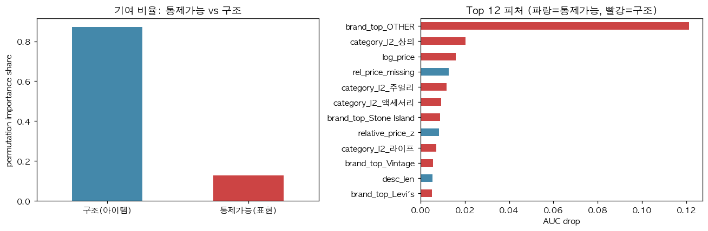
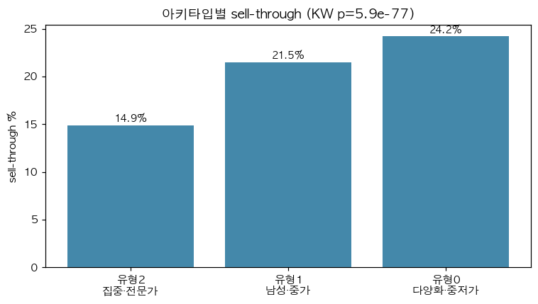

# 스타일이 파는가, 구조가 파는가: 빈티지 C2C 패션 플랫폼(FruitsFamily)의 판매 전환 결정요인 분석과 셀러 가이드 재설계

소프트웨어융합학과 3학년 박재원  
학번: 2022105461

---

## 초록 (Abstract)

빈티지 의류는 1점물(unique item)이라 시세 비교·검수 표준화가 어렵고, 그 결과 C2C 플랫폼에서 대다수 매물이 팔리지 않는 **유동성 문제**를 안는다. 본 연구는 SNS형 빈티지 C2C 플랫폼 FruitsFamily의 매물 288,903건·셀러 11,096명을 크롤링하여, 플랫폼이 모든 셀러에게 동일하게 제시하는 일반 등록 안내("사진 많이·설명 자세히")가 판매 전환(`is_sold`)과 어떤 관계인지를 **관측 데이터**로 검증했다. (1) 로지스틱 회귀에서 사진·설명 권고의 음의 연관은 가격·브랜드·컨디션·매물연령을 통제하면 거의 사라졌고(통제 후 사진 OR 0.945, 성숙 코호트에서는 0.98로 사실상 1에 수렴), 성향점수매칭의 처치효과(ATT −2.2%p)는 관측변수 균형은 달성했으나 E-value 1.49로 미관측 교란에 취약했다 → **플랫폼이 이 권고가 판매를 돕는다고 확신할 근거는 없다.** (2) Gradient Boosting에서 판매 전환 예측력은 셀러가 바꿀 수 없는 아이템 구조(브랜드·가격·카테고리, AUC 0.77)가 통제가능 표현(AUC 0.62)을 크게 앞섰고, 매물연령(시간) 단독 기여는 미미하여(AUC 0.53) 이 우위가 절단(censoring) 아티팩트가 아님을 확인했다. (3) 셀러는 브랜드 집중도 등으로 안정적으로 군집되며(단 분리 강도는 약함), 브랜드 집중형(전문가형)은 가격·카테고리를 통제해도 유의하게 낮은 전환율을 보였다(OR 0.52, p<.001). 종합하면 일반 노력 독려는 비표준 빈티지의 유동성을 풀지 못하며, 처방은 **동종 가격 밴드 제시·세그먼트별 안내·취향 네트워크 기반 매칭**으로 전환되어야 한다. 위시리스트(커버리지 90.3%) 분석에서 90일 이상 미판매 재고의 80%(인기 브랜드 제외 기준)가 도달 가능한 관심 풀을 가져 매칭 개입의 실현 가능성을 시사한다. 단 모든 결과는 관측 기반이므로 인과 확정에는 A/B 실험이 필요하다.

---

## 1. 서론

**문제 배경.** 중고·리세일 패션 시장은 지속가능성과 Z세대의 빈티지 소비 트렌드를 타고 빠르게 성장하고 있다[1]. 국내에서도 당근마켓·번개장터·KREAM 등 중고거래 플랫폼이 확산되었으나[2], 이들은 대체로 *표준화된* 재화(생활용품, 정품 스니커즈 등)를 전제로 위치 기반 신뢰나 시세 비교·검수에 강점을 둔다. 반면 FruitsFamily 같은 SNS형 **빈티지** 패션 플랫폼은 동일 품목이 존재하지 않는 1점물(희소재)을 다루므로[8] 시세 비교도 검수 표준화도 불가능하다.

**문제 제기.** 본 연구가 수집한 데이터에서 전체 매물의 **78.5%가 끝내 판매되지 않았고**, 미판매 재고의 55%가 90일 이상 방치되었으며, 셀러의 15.9%는 단 한 건도 팔지 못했다. 즉 핵심 문제는 *판매 속도*가 아니라 *애초에 팔리는가*라는 **매칭/유동성**이다. 그럼에도 플랫폼이 제공하는 유일한 처방은 모든 셀러에게 동일한 일반 안내("다양한 상세사진 첨부", "구매시기·하자·소재·실측 등 설명을 자세히")뿐이다. 그런데 원시 데이터에서는 사진 ≤2장 매물의 전환율(26.4%)이 6장 이상(18.7%)보다 높고, 설명이 짧은 매물(<50자, 25.0%)이 긴 매물(300자+, 17.3%)보다 더 팔려, **가이드를 충실히 따른 매물일수록 덜 팔리는** 역설이 관찰된다([그림 1]). 단 이 역설은 원시 상관이며, 본론에서 교란·절단을 통제해 그 실체를 규명한다.

[그림 1] 일반 가이드의 역설(원시 데이터): (좌) 사진 수↑·(우) 설명 길이↑일수록 전환율↓.

**기존 연구/서비스의 한계와 본 연구의 동기.** 중고 패션 관련 학술 연구는 구매자 동기·신뢰·가격 결정에 집중되어 있고[1][3][4], 리세일 이미지 품질 연구[5]도 *판매 가능성과의 상관*만 보고할 뿐 사진 장수·설명 길이의 효과를 교란 통제 하에 인과적으로 검증하지 않는다. 패션 스타일 임베딩 연구[6]는 스타일 분류·검색에 그쳐 판매 성과와 연결하지 않았고, Depop·Poshmark 등의 셀러 가이드[7]는 데이터 검증이나 개인화 없는 휴리스틱이다. 즉 **"셀러가 통제 가능한 행동이 비표준 빈티지의 판매 전환을 인과적으로 얼마나 움직이는가"**, 그리고 **"일반 조언을 무엇으로 대체할 것인가"**는 비어 있다. 본 연구는 이 공백을 셀러-측 처방 관점에서 채운다.

**가설.** 결과변수를 판매 전환 `is_sold`로 두고 세 가설을 검정한다.
- **가설 1 (통계/인과).** 사진 수·설명 길이의 음의 상관은 교란(어려운 매물에 노력이 몰리는 역선택) 때문이며, 가격·브랜드·카테고리·컨디션·매물연령을 통제하면 일반 가이드의 권고 효과는 사라지거나 역방향이다.
- **가설 2 (지도학습).** 판매 전환은 셀러가 *통제 가능한* 표현 요소(사진·설명·상대가격)보다 *통제 불가능한* 구조적 요소(브랜드 수요·가격대·카테고리)에 더 좌우된다.
- **가설 3 (비지도학습).** 셀러는 소수의 스타일 아키타입으로 군집되며 아키타입별 판매 전환율이 유의하게 다르다.

**분석 내용 요약.** Python 크롤러로 FruitsFamily의 매물·셀러·위시리스트를 SQLite에 수집(288,903 매물 / 11,096 셀러)했다. 가설 1은 로지스틱 회귀와 성향점수매칭(PSM), 가설 2는 Gradient Boosting의 통제가능 vs 전체 피처 성능 비교 및 순열중요도 분해, 가설 3은 구조 시그니처 기반 K-means 군집과 Kruskal–Wallis 검정으로 분석했다. 결과적으로 통제 후 일반 가이드를 지지하는 연관은 거의 사라졌고(가설 1), 전환은 아이템 구조가 표현보다 크게 앞섰으며(가설 2), 전문가형 셀러는 가격·카테고리 통제 후에도 유동성에서 불리했다(가설 3). 모든 추정은 관측 기반이므로 그 강건성을 별도 절(3.4)에서 점검한다. 이는 셀러 노력 독려 중심의 현행 처방을 가격 투명화·세그먼트별 안내·취향 매칭으로 전환해야 함을 시사한다.

## 2. 관련 연구

**2.1. 중고 패션 소비·가격 연구.** 기존 문헌은 주로 *구매자* 관점에서 중고 소비 동기(경제·헤도닉·지속가능성)와 신뢰를 다루거나[1], C2C 거래의 가격 동학·평판 기반 가격 전략을 분석한다[3][4]. 리세일 마켓의 이미지 품질이 판매 가능성과 연관된다는 보고도 있으나, 조회수 같은 사후 변수가 더 강한 예측자였다고 밝혀 셀러가 통제 가능한 요소의 인과적 기여는 불분명하게 남겨 둔다[5].

**2.2. 스타일 표현·셀러 실무 가이드.** 비지도 패션 스타일 임베딩 연구는 라벨 없이 스타일 군집을 발견하지만 판매 성과와 연결하지 않는다[6]. 산업 현장의 셀러 가이드(Depop·Poshmark)는 "사진을 많이/자주 올려라"식 일반 휴리스틱으로, 데이터 검증과 셀러 유형별 개인화가 부재하다[7].

**차별점.** 본 연구는 (i) 결과변수를 가격이 아닌 **판매 전환**으로 두어 유동성 문제를 직접 겨냥하고, (ii) 일반 가이드를 **교란 통제 및 민감도 분석(PSM·E-value)**으로 검증하며, (iii) **통제가능 vs 구조 요인의 기여를 정량 분해**하고, (iv) 스타일 아키타입과 **위시리스트 취향 네트워크**를 판매 성과·매칭 가능성과 연결한다는 점에서 선행 연구·서비스와 구별된다.

## 3. 본론

**데이터.** FruitsFamily(fruitsfamily.com)를 학술용 식별자 User-Agent와 요청 간 1–2초 지연으로 크롤링하여 SQLite에 저장했다. 페이지는 React SSR의 `__APOLLO_STATE__` JSON을 1차로, BeautifulSoup 텍스트 휴리스틱을 2차로 파싱했다. 수집 규모는 매물 288,903건(셀러 11,096명, 등록일 2020–2026)이며, 분석에는 placeholder·결측(등록일/설명/가격) 행을 제외한 284,654건을 사용했다. 결과변수는 판매 여부 `is_sold`(전체 전환율 21.5%)이다. 통제가능 피처는 사진 수·설명 길이·키워드(실측/하자/소재 등)·상대가격이고, 구조 피처는 브랜드·카테고리·컨디션·로그가격·매물연령이다. 조회수·찜수는 등록 후 누적되는 사후 변수(누수)이므로 예측에서 제외하고 사후 진단·수요 신호로만 사용했다. 셀러의 공개 위시리스트도 수집하여(커버리지 90.3%, owners 10,023, 277,651행) 취향 네트워크 분석에 활용했다. 본 보고서의 모든 수치는 분석 산출물(`notebooks/00–06`, `results/*.json`)에서 직접 인용되며, 주요 주장–근거 파일 대응은 [표 3]에 정리한다.

### 3.0. 분석 방법과 추론 틀

세 가설은 서로 다른 분석 패러다임(통계·지도·비지도)을 사용하며, 각 패러다임은 *귀무가설을 무엇으로 두고 어떻게 기각하는가*가 다르다. 분석에 앞서 그 틀을 정리한다.

- **통계(H1) — 왜 로지스틱+PSM인가.** 결과가 이항(`is_sold`)이므로 로지스틱 회귀로 각 레버의 부분효과를 오즈비(OR)로 추정한다. *무엇을 보이려는가*: 일반 가이드 변수(사진·설명)의 효과가 교란을 통제한 뒤에도 남는가. 귀무가설은 "해당 계수 β=0"이며 Wald 검정 p-value로 판정한다. 회귀는 *관측된* 공변량만 통제하므로 처치(가이드 준수)–대조의 비교가능성을 높이기 위해 **성향점수매칭(PSM)**을 병행한다. 다만 회귀·PSM 모두 *미관측* 교란은 보정하지 못한다는 한계가 있어 **E-value**로 '결론을 뒤집는 데 필요한 미관측 교란의 크기'를 정량화한다.
- **지도학습(H2) — 왜 Gradient Boosting + 재표집 검정인가.** 비선형·상호작용이 많은 매물 데이터에서 *예측 가능성의 상한*을 재려면 유연한 모형이 필요하다. *무엇을 보이려는가*: 셀러가 바꿀 수 있는 표현 변수만으로 도달하는 예측력(AUC)과 바꿀 수 없는 구조 변수까지 넣은 예측력의 격차. 지도학습엔 모수적 검정이 없으므로 귀무가설을 둘로 두고 **재표집**으로 기각한다 — (i) "예측력=우연(AUC 0.5)"은 **라벨 순열검정**으로, (ii) "통제가능=구조(ΔAUC=0)"는 **부트스트랩 95% 신뢰구간**으로. 이 기법은 분포를 가정하지 않고 표본 자체에서 불확실성을 만든다는 특징이 있다.
- **비지도학습(H3) — 왜 군집화 + 이중 검정인가.** 셀러의 '스타일 유형'은 사전 라벨이 없어 군집으로 *발견*한다. 정답이 없으므로 검정도 두 층위다 — (i) **군집 존재성**: 결합구조를 파괴한 무작위 참조의 실루엣 분포 대비 관측 실루엣이 유의한가(귀무: 구조 없음), (ii) **외적 타당성**: 발견된 유형이 외부 변수(sell-through)와 연관되는가를 **Kruskal–Wallis**(귀무: 군집 간 분포 동일)·효과크기 ε²·가격통제 로지스틱으로 검정한다. 군집 자체는 기술적 구성물이며 인과가 아니라 *연관·유형 간 차이*를 본다는 가정 위에 선다.

[표 3] 주요 주장–근거 산출물 대응

| 보고서 주장/수치 | 산출 파일 (노트북) |
|---|---|
| 미판매 78.5%·죽은재고 55%·무판매셀러 15.9%·사진/설명 역설 | `results/eda.json` (00) |
| 사진 OR 0.945·"3장" 임계·키워드 OR·PSM ATT | `results/h1.json` (01) |
| AUC 0.62/0.77/0.79·순열 p·ΔAUC CI·기여 87/13·가격대 이질성 | `results/h2.json` (02) |
| 아키타입 전환율·KW·ε²·실루엣 검정·벤치마크 격차 | `results/h3.json` (03) |
| 묵은재고 매칭 80~98%·취향 구조 | `results/p4_taste_network.json` (05) |
| 코호트 재현·E-value·age 분해·군집 안정성·전문가형 OR 0.52 | `results/robustness.json` (06) |

### 3.1. 가설 1 — 일반 가이드는 판매를 돕는가 (통계·준인과)

**방법·가정.** 결과가 이항이므로 로지스틱 회귀로 각 레버의 부분효과를 OR로 추정하고, 귀무가설 'β=0'을 Wald 검정으로 판정한다. 구조 변수(브랜드 상위·카테고리·컨디션·로그가격·매물연령)를 함께 투입해 *관측* 교란을 통제하며, 표본은 가이드 변수가 모두 채워진 284,654건이다. 이어 "가이드 준수(사진 3장+ & 설명 150자+)"를 처치로 둔 성향점수매칭으로 비교가능성을 높이되, 미관측 교란 취약성을 E-value로 함께 보고한다. *무엇을 보이려는가*: raw에서 관찰된 음의 상관([그림 1])이 교란의 산물인지, 통제 후에도 권고를 지지하는 효과가 남는지를 가른다.

`is_sold`에 대한 로지스틱 회귀에서 사진 수의 효과는 통제 전 오즈비(OR) 0.874였으나 가격·브랜드·카테고리·컨디션·매물연령 통제 후 0.945로 음의 효과가 약 58% 감소했고, 설명 길이도 0.924→0.971로 감소했다(의사결정계수 pseudo-R²는 0.005→0.131). 음의 상관 대부분이 교란임이 확인되나, 통제 후에도 1을 넘지 못해 "많을수록 좋다"는 지지되지 않았다. 가이드 핵심 권고인 "사진 최소 3장"은 ≤2장 대비 3–5장 OR 0.915, 6장+ 0.855로 **오히려 단조 감소**했다. 키워드별로는 실측(0.75)·관리법(0.81)·하자고지(0.89) 등 "자세한 설명" 요소가 음의 방향이었고, 사용 맥락(1.13)·소재(1.04)·합리적 상대가격(1.03)만 양의 방향이었다([그림 2]). 가이드 준수(사진 3장+ & 설명 150자+)를 처치로 본 PSM에서 단순 차이 −4.9%p의 절반가량이 교란이었으나 매칭 후에도 ATT는 **−2.2%p**로 음(陰)이었다.

[그림 2] 통제 후 표현 레버별 판매 오즈비(95% CI). 점선(OR=1) 좌측은 음의 연관.

**논의.** 일반 가이드의 "사진·설명을 늘려라"는 **관측 데이터상 지지되지 않는다.** 음의 연관은 대부분 교란(어려운 매물에 노력이 몰리는 역선택)과 절단으로 설명된다 — 성숙도 하한을 고정한 코호트(등록 1–2년 전, 모두 ≥12개월 노출, n=39,528)에서 사진 효과는 통제 후 OR 0.945에서 **0.98로 사실상 1에 수렴**하고 전환율 격차도 7.7%p→4.6%p로 축소되어 잔여 효과가 미미했다(3.4). PSM의 ATT(−2.2%p)는 관측 공변량 균형(표준화평균차<0.03)은 달성했으나 E-value가 1.49에 불과해, 매물의 본질적 매력 같은 **미관측 교란이 처치·결과와 각각 RR≈1.5만 연관돼도 효과가 소멸**한다. 또한 '하자'·'실측' 키워드는 정의상 내생적(하자 언급=하자 존재)이라 음의 연관을 인과로 읽을 수 없다. 따라서 "가이드가 판매를 떨어뜨린다"고 단정할 수는 없고, 정직한 결론은 **플랫폼이 이 권고의 유효성을 확신할 근거가 없다**는 것이다. 핵심은 "적게 하라"가 아니라 노력의 양이 결정요인이 아니라는 점이다(가설 2로 연결).

### 3.2. 가설 2 — 통제가능 vs 구조적 요인의 기여 분해 (지도학습)

**방법·가정.** 이 분석은 *예측 가능성의 상한*을 재기 위한 것으로, 피처군을 통제가능(표현)·아이템 구조·시간(연령)으로 나눠 각각의 AUC를 비교한다(누수 방지를 위해 조회·찜 제외). 셀러 노력의 한계는 "통제가능-only AUC가 얼마나 낮은가"로, 구조의 우위는 "ΔAUC가 유의하게 0보다 큰가"로 드러난다.

Gradient Boosting으로 `is_sold`를 예측할 때 5겹 교차검증 AUC는 통제가능 표현 피처만 0.624, 아이템 구조(브랜드·카테고리·가격) 피처만 0.765, 전체 0.786이었다([표 1]). **귀무 기각**: 라벨 순열검정에서 전체 모형 테스트 AUC(0.788)는 우연(순열 null 평균 0.500)을 유의하게 초과했고(p<0.001), 부트스트랩 ΔAUC(구조−통제가능)의 95% 신뢰구간은 **[0.138, 0.151]**로 0을 배제해 "구조=통제가능" 귀무를 기각했다(전체−통제가능 [0.159, 0.169]). 중요한 점은 **매물연령(시간) 단독 AUC가 0.530**에 불과해, 구조의 우위가 절단(오래된 매물일수록 팔릴 시간이 많음) 아티팩트가 아니라 *무엇을 파는가*에서 비롯됨을 보인다. 순열중요도 그룹 합산도 구조 우위(약 87% vs 13%)였으나, 이는 상관된 피처 하의 *예측모형 점유율*이므로 본 연구는 AUC 격차를 1차 근거로 삼는다. 단일 최대 신호는 "비주류 브랜드 여부"였다. 통제가능 레버의 예측력은 저가대 AUC 0.65에서 고가대(20만 원+) 0.57로 떨어져, **고가품일수록 셀러 노력의 여지가 더 작았다**([그림 3]).

[표 1] 피처군별 판매 전환 예측 성능(5겹 CV AUC, 시간 변수 분리)

| 피처군 | AUC |
|---|---|
| 통제가능 표현(사진·설명·상대가격) | 0.624 |
| 아이템 구조(브랜드·카테고리·가격) | 0.765 |
| 매물연령(시간)만 | 0.530 |
| 전체 | 0.786 |

[그림 3] (좌) 통제가능 vs 구조 기여 비율, (우) 상위 피처(파랑=통제가능, 빨강=구조).

**논의.** 판매 전환은 "무엇을 파는가(브랜드·가격)"가 표현·노력보다 크게 앞서며(AUC 0.77 vs 0.62), 그 우위는 시간 아티팩트가 아니다(시간 단독 0.53). 셀러가 움직일 수 있는 여지는 제한적이고 고가 셀러에게 특히 작다. 따라서 일률적 노력 독려는 헛된 기대를 준다.

### 3.3. 가설 3 — 스타일 아키타입과 판매 성과 (비지도학습)

셀러를 구조 시그니처(브랜드 집중도·성별·가격대·컨디션 구성)로 K-means 군집한 결과 k=3에서 분리가 가장 컸다(실루엣 0.29로 강하진 않으나 시드 간 군집 일치도 ARI=1.0으로 안정적; 매물 5건 이상 셀러 86.7% 포함). **군집 존재성 검정**(귀무: 구조 없음)에서 관측 실루엣(0.287)은 각 피처를 독립 셔플한 무작위 참조의 실루엣(0.225)을 유의하게 상회해(p=0.02), 약하지만 우연 이상의 군집 구조가 존재했다. 아키타입별 전환율은 다양화·중저가형 24.2%, 남성·중가 다양화형 21.5%, **브랜드 집중(전문가)형 14.9%**로 유의하게 달랐다(Kruskal–Wallis H=351, p<10⁻⁷⁶)([그림 4]). 다만 **효과크기 ε²=0.036(작음)**으로, 유형 간 차이는 통계적으로는 확고하되 *개인 셀러 수준의 설명력은 제한적*임을 함께 밝힌다(셀러 간 분산이 크기 때문). 이 차이는 단순한 가격·카테고리 교란이 아니다 — 가격·카테고리·컨디션·매물연령을 통제한 로지스틱에서도 전문가형의 전환 오즈비는 **0.52(p<.001)**로 유의하게 낮았다(3.4). 즉 스타일 시그니처가 뚜렷한 전문가형이 가장 안 팔리는 패턴은 관측 공변량에 강건하며, 집중이 가격 프리미엄과 유동성의 trade-off일 가능성을 시사한다. 다만 아키타입 내 상위 전환 셀러가 설명을 *덜* 쓴다는 관찰은 가설 1과 같은 역인과 가능성이 커 '적게 쓰라'로 해석하지 않는다.

[그림 4] 아키타입별 판매 전환율(대표 브랜드 표기).

**논의.** 한 줄짜리 일반 조언 대신 "같은 유형의 잘 파는 셀러" 벤치마크가 필요하며, 전문가형에게는 유동성↔가격 trade-off를 명시해야 한다. 더불어 위시리스트 취향 네트워크에서 90일 이상 미판매 매물의 **80%**(인기 상위 10개 브랜드 제외 기준; 미제외 시 98.3%)가 해당 브랜드를 찜한 셀러를 1명 이상 가져, 죽은 재고에 도달 가능한 수요 풀이 존재했다. 단 이 지표는 (i) 위시 주체가 구매자가 아닌 *셀러*이고 (ii) item이 아닌 brand 수준 프록시라는 한계가 있어, 매칭 *후보 모수*의 존재를 보일 뿐 전환 효과는 A/B가 필요하다.

### 3.4. 강건성·위협요인 (Threats to Validity)

본 분석은 모두 관측·단면(`is_sold`에 판매시점 `sold_at` 없음) 데이터에 기반하므로 인과 해석에 한계가 있다. 주요 위협과 점검 결과를 [표 2]에 요약한다. 핵심 결론(노력의 양은 결정요인이 아님, 구조 우위, 전문가형 저유동성)은 점검을 통과했으나 그 *강도*는 보수적으로 해석해야 한다. 또한 (i) 수집 표본은 RECENT 정렬·특정 시드 기반이라 플랫폼 전수를 대표하지 않으며, (ii) 무판매 셀러 15.9%는 대부분 신규·소규모 셀러로(매물 중앙값 4건, 최근 매물 중앙값 46일, 180일+ 방치 16%뿐) '분투하는 셀러'와 '아직 초기인 셀러'가 섞여 있다.

[표 2] 강건성 점검 요약

| 위협 | 점검 방법 | 결과 |
|---|---|---|
| 절단/시간 교란 | 성숙 코호트(등록 1–2년) 재현 | 사진 효과 OR 0.945→**0.98**(코호트), 음의 연관 거의 소멸 |
| 미관측 교란 | PSM 공변량 균형 + E-value | SMD<0.03(균형 양호), E-value 1.49(약한 교란에 취약) |
| 시간이 '구조' 기여 부풀림 | AUC에서 age 분리 | age 단독 0.53 → 구조 우위는 시간과 무관 |
| 군집 불안정·교란 | 시드 ARI + 가격·카테고리 통제 | ARI 1.0(안정), 전문가형 OR 0.52(통제 후 유지) |
| P4 프록시 과대 | 인기 상위10 브랜드 제외 | 매칭가능 98.3%→80%(여전히 견고) |

## 4. 결론

세 가설을 종합하면, FruitsFamily의 일반 등록 가이드는 (1) 가격·브랜드·컨디션·연령과 절단을 통제하면 **이를 지지하는 연관이 거의 사라지고**(잔여 효과도 미관측 교란에 취약), (2) 판매 전환은 셀러가 바꿀 수 없는 **아이템 구조가 표현·노력보다 크게 앞서며**(AUC 0.77 vs 0.62, 시간 아티팩트 아님), (3) 스타일이 뚜렷한 **전문가형이 가격·카테고리 통제 후에도 유동성에서 불리**하다. 즉 "사진·설명을 늘려라"가 비표준 빈티지의 유동성 문제를 풀 것으로 기대하기 어렵다. 본 분석의 의의는, 모두에게 같은 노력을 요구하는 현행 처방이 데이터로 **뒷받침되지 않음**을 보이고 그 대안을 제시한 데 있다. 전달 메시지는 명확하다: 플랫폼은 셀러를 더 굴릴 것이 아니라 **(i) 등록 시 동종(브랜드×카테고리×컨디션) 가격 밴드를 제시하고, (ii) 일반 안내를 세그먼트·아키타입별 처방으로 대체하며, (iii) 위시리스트 취향 네트워크로 묵은 재고를 관심 구매자에게 매칭**해야 한다. 모든 결과가 관측 기반인 만큼 이는 *우선 검증할 가설*이며, 각 처방의 효과는 A/B 실험으로 확정해야 한다 — 본 연구는 무엇을 먼저 실험할지에 대한 데이터 근거를 제공한다.

## 5. 참고 문헌

*(주: 아래 서지정보 중 저자·권·호·쪽수는 초고 단계의 잠정 기재이므로 제출 전 원문으로 검증·보정할 것.)*

[1] W. Gilal et al., "Secondhand consumption: A systematic literature review and future research agenda," International Journal of Consumer Studies, 2024.  
[2] 박지호, "플랫폼 4989 ① 중고거래: 당근마켓·번개장터·크림," brunch, 2023.  
[3] X. Liu et al., "Dynamic decisions between sellers and consumers in online second-hand trading platforms: Evidence from C2C transactions," Transportation Research Part E, vol. 177, 2023.  
[4] Q. Zhang, "Reputation dependent pricing strategy: analysis based on a Chinese C2C marketplace," arXiv:2109.12477, 2021.  
[5] X. Zhang et al., "Understanding Image Quality and Trust in Peer-to-Peer Marketplaces," arXiv:1811.10648, 2018.  
[6] W.-L. Hsiao and K. Grauman, "Learning the Latent 'Look': Unsupervised Discovery of a Style-Coherent Embedding from Fashion Images," arXiv:1707.03376, 2017.  
[7] Voolist, "How to Sell on Depop in 2026: Photos, Pricing & Algorithm Tips," 2026.  
[8] S. Park, "Scarce fashion products consumption in the C2C second-hand trading platform," Family and Consumer Sciences Research Journal, 2023.
